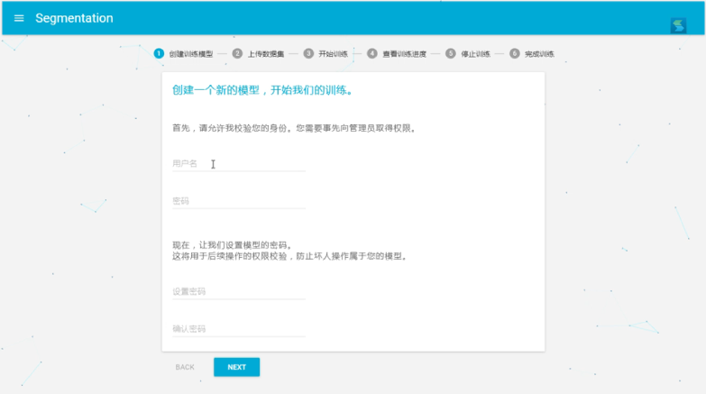

# SegNet API
This is a website api for SegNet, enable users and trainers use our model to do image segmentation and create their own models.</br>
It also provides [a base website interface](https://github.com/Woolseyyy/SegNet-WebsiteAPI/tree/master/example) to use our apis.</br>
Of course, you can use our apis in your own application.</br>



## Dependence
Make sure you have installed caffe.</br>
You are also required to install nodejs and npm.</br>
Also, you should make sure your server have at least one powerful gpu to do deep learning. Over than Nvidia M40 is needed.</br>

## Build
First, download this project and get some dependences
```
git clone https://github.com/Woolseyyy/SegNet-WebsiteAPI.git
cd SegNet-WebsiteAPI
npm install
```
Then, you should config some script files path in <i>utils/config.js</i>, you can read <a href="http://mi.eng.cam.ac.uk/projects/segnet/tutorial.html">segnet tutorial</a> to understand the scripts meaning.</br>
Also you should set blockSize in that file. It means the least block size your training model need. It is determined by the argument * batch size * in your model

Finally, for base testing, you are required to config your base model, named 0, as following.
```
+Your Project Root Path
  +models
     +0
       +TempTestInterface
       +tempTestResult
       -test_weights.caffemodel
```
<i>test_weights.caffemodel</i> is the weights you pre training. It is userd for those users who just want to conduct a image segmentation. You are recomanded to understand <a href="http://mi.eng.cam.ac.uk/projects/segnet/tutorial.html">segnet tutorial</a> first, and the <i>test_weights.caffemodel</i> can be seen in the test part.

## Run
```
nodejs bin/www
```

## API

### User API
|  api  | parameters | description |
| ----- | ---------- | ----------- |
| /api/test | [Model ID], Files | Upload images and conduct segmentation |

### Trainer API
|  api  | parameters | description |
| ----- | ---------- | ----------- |
| /api/create | Model password, User name, User password | Upload images and conduct segmentation |
| /api/train/prepare/data | Model ID, Model password, Files | Upload data of datasets |
| /api/train/prepare/label | Model ID, Model password, Files | Upload label of datasets |
| /api/train/prepare/relation | Model ID, Model password, Files | Upload relation of datasets |
| /api/train/start | Model ID, Model password | Start Training |
| /api/train/procedure | Model ID, Query range | Watch procedure of training |
| /api/train/stop | Model ID, Model password | Stop Training |
| /api/train/finish | Model password, User name | Save weights |
| /api/train/clear | Model ID, Model password | Clear training model |